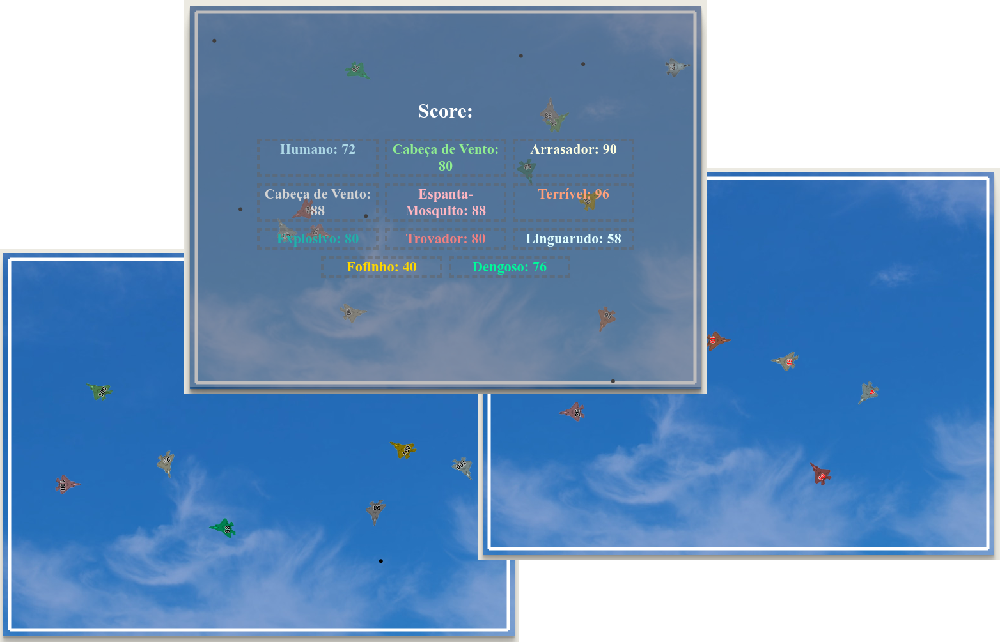
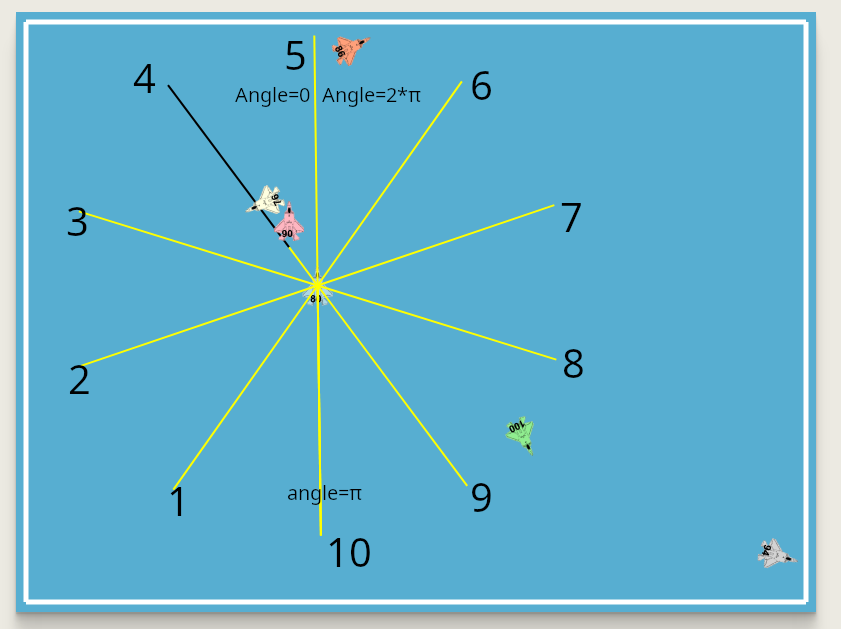

# Batalha de Jatos

Trabalho desenvolvido para a disciplina de Inteligência Artificial da UFES, campus Alegre.

<p align="center"></p>

Ele segue a linha de trabalhos em Prolog que tenho elaborado para meus alunos. Os primeiros trabalhos foram:
* [Corrida em Prolog](https://github.com/jeiks/corrida_em_prolog) - ([Online](https://www.jeiks.net/corrida_em_prolog/))
* [Batalha de Tanques](https://github.com/jeiks/batalha_tanques) - ([Online](https://www.jeiks.net/batalha_tanques/))

O código inicial da corrida foi uma adaptação do projeto do Radu Mariescu-Istodor:
[Self-driding car - No libraries - JavaScript Course](https://www.youtube.com/watch?v=NkI9ia2cLhc)\
Atualmente, já modifiquei bastante o código. Mas a inspiração veio do trabalho dele.

O objetivo desse trabalho é controlar um jato utilizando código em Prolog ([SWI-Prolog](https://www.swi-prolog.org/)) para que ele seja o único sobrevivente.
Após isso, também será realizada uma disputa em sala de aula, com todos os trabalhos.

Regras:
* Cada jato sempre terá uma velocidade mínima para não cair;
* Cada jato pode aumentar ou diminuir sua velocidade em um intervalo pré-definido de máximo e mínimo;
* Cada jato pode atirar um míssil por segundo;
* Cada jato começa com uma vida de 100 pontos;
* Se encostar nas laterais do ambiente, perde 2 pontos de vida por segundo que estiver em contato/atrito;
* Se for atingido por um míssil, perde 10 pontos de vida.
* Os aviões podem passar sobre os outros, pois estão em altitudes diferentes. ;)

Teclas:
* Setas do teclado: movimentação do jato.
* Espaço ou ENTER: atira\
  Obs.: só pode atirar uma bala por segundo.
* Tecla "s": exibe e esconde o placar do jogo.

Se você quiser testar online, acesse [http://jeiks.net/prolog_jatos](https://www.jeiks.net/prolog_jatos/)
 
### Instruções
Há várias formas de utilizar esse código, escolhendo colocar um jato movido pelo teclado, nenhum ou vários jatos movidos aleatoriamente pelo JavaScript e nenhum ou vários jatos movidos pelo Prolog.

Para isso, edite as seguintes linhas do arquivo "main.js":

```js
dummyJets=10, // quantidade de jatos aleatórios
keysJet=true, // modifique para ter um jato controlado pelo teclado
prologJets=["Ligerin", "ApagaFogo"], // nomes (e quantidade) dos jatos movidos pelo prolog
```

Caso não tenham jatos movidos pelo Prolog, deixe o vetor referente vazio:
```js
prologJets=[],
```

Quando não há jatos movidos pelo Prolog, você pode executar o arquivo index.html diretamente no navegador de Internet (obs. foi testado no Brave Browser).

Caso existam jatos movidos pelo Prolog, siga os passos abaixo.

### Como executar o servidor pelo Prolog

1. Instale o SWI-Prolog em seu GNU/Linux (derivado Debian) com: ``sudo apt install swi-prolog`` (ou baixe em [https://www.swi-prolog.org/](https://www.swi-prolog.org/))
2. Baixe esse repositório: ``git clone https://github.com/jeiks/prolog_jatos``
3. Entre no diretório criado: ``cd prolog_jatos``
4. E execute o comando: ``swipl -s servidor.pl`` (ou abra esse arquivo no swi-prolog)

Ele já inicia o servidor automaticamente e exibe a seguinte mensagem:
<pre>
   --========================================--

   % Started server at http://localhost:8080/


   --========================================--
</pre>

Agora então, é só ir ao navegador de internet e acessar o endereço acima.

A implentação aqui está fornecendo dois jatos que tem movimentos aleatórios.

O primeiro é implementado no arquivo "jato0.pl" e o seguindo no arquivo "jato1.pl".

Ao adicionar mais jatos no "main.js", edite o arquivo "jatos_controle.pl", seguindo os exemplos já apresentados lá.

Para implementar a inteligência dos jatos, edite e siga as intruções do arquivo "jato0.pl" ou "jato1.pl"

Have fun =)

### Informações adicionais

Abaixo estão os sensores e também o valor do ângulo do jato:


